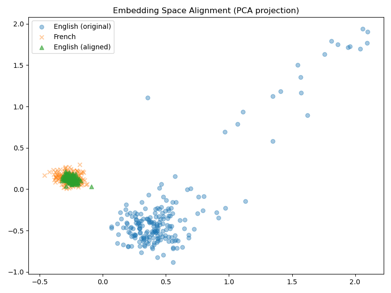

# Enhanced Machine Translation with Word Embeddings

This project implements a simple **English → French word translation model**
using pretrained word embeddings and a learned linear transformation.

It is based on aligning English and French embedding spaces so that
semantically similar words lie close to each other.

## Features

- Loads pretrained English and French word embeddings
- Uses a bilingual dictionary (train / test) for supervision
- Learns a linear mapping with gradient descent to minimize `||XR - Y||²`
- Translates words via nearest neighbor search in the French embedding space
- Evaluates accuracy on a held-out test dictionary

## How it works

1. Build matrices `X` (English) and `Y` (French) for aligned word pairs.
2. Optimize a transformation matrix `R` so that `XR ≈ Y`.
3. For a new English word:
   - Project its embedding with `R`
   - Find the closest French embedding (cosine / L2 distance)
4. Measure how often the predicted French word matches the gold translation.

On the current setup, the model reaches about **0.56 accuracy** on the test dictionary.

## Results & Visualizations

The project generates:

- `results/loss_curve.png`: Training loss over iterations.
- `results/embedding_alignment.png`: PCA visualization showing how English embeddings
  move closer to their French counterparts after applying the learned transformation.

These plots illustrate that the model is not just memorizing translations, but learning
a linear mapping between semantic spaces.

## 🧭 Results

Below is a 2D PCA projection showing the effect of the learned alignment:



The blue points are original English embeddings, the orange crosses are French embeddings,  
and the green triangles are the English embeddings after transformation.  
The overlap between green and orange points shows that the model successfully aligned the two languages.


## Project Structure

```text
.
├── data/                # embeddings + bilingual dictionaries
├── src/                 # core implementation
├── notebooks/           # experimental notebook
├── results/             # (to store logs, plots, reports)
├── README.md
├── requirements.txt
└── .gitignore
